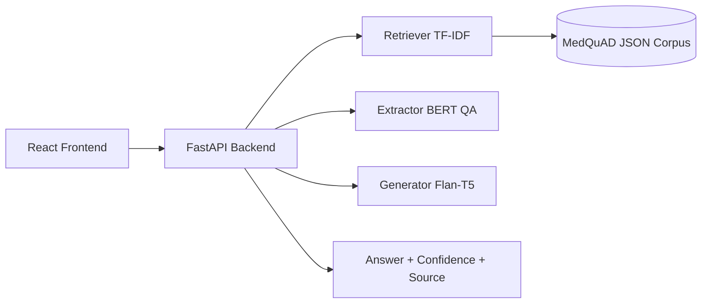

# MediMind - Medical Question Answering System

[](https://medimind-nu.vercel.app/)


MediMind is a full-stack medical question answering system with a React frontend and FastAPI backend. It uses TF-IDF retrieval over MedQuAD, extractive QA with BERT, and answer refinement with Flan-T5.

Live URL: https://medimind-nu.vercel.app/

Repository: https://github.com/ManikantaPerla07/MediMind-medical-QA-system

Backend: https://huggingface.co/spaces/Manikantaperla/medimind-api/tree/main

## Table of Contents

- [Overview](#overview)
- [Feature Highlights](#feature-highlights)
- [Resume Highlights](#resume-highlights)
- [Screenshots](#screenshots)
- [Tech Stack](#tech-stack)
- [Architecture](#architecture)
- [Architecture Diagram](#architecture-diagram)
- [Project Structure](#project-structure)
- [API Reference](#api-reference)
- [Environment Variables](#environment-variables)
- [Run Locally](#run-locally)
- [Docker Deployment](#docker-deployment)
- [Troubleshooting](#troubleshooting)
- [FAQ](#faq)
- [Safety Notes](#safety-notes)
- [Contributing](#contributing)
- [Changelog](#changelog)
- [Roadmap](#roadmap)
- [Author](#author)
- [License](#license)
- [Medical Disclaimer](#medical-disclaimer)

## Overview

MediMind routes medical questions by intent, retrieves relevant medical passages, then generates a final response with confidence metadata. It is designed for practical demos, portfolio presentation, and experimentation with retrieval + generation pipelines.

## Feature Highlights

- Question routing for 8 query types: yes/no, how, factoid, comparison, treatment, list, evidence, general.
- Retrieval pipeline using TF-IDF and cosine similarity over MedQuAD passages.
- Hybrid QA flow:
  - Extraction model: deepset/bert-base-cased-squad2
  - Generation model: google/flan-t5-base
- Confidence-aware response handling, including low-confidence abstention.
- False-premise checks for harmful claim patterns.
- React + Vite frontend with Axios API client.
- FastAPI backend with CORS enabled and health endpoint.
- Dockerfile included for backend containerized deployment.

## Resume Highlights

- Built an end-to-end medical QA system using FastAPI, React, and transformer-based NLP models.
- Implemented retrieval + extractive + generative answer pipeline for medically grounded responses.
- Processed MedQuAD XML corpus into a searchable JSON knowledge base and serialized retriever artifacts.
- Added confidence scoring and abstention behavior to reduce risky low-confidence outputs.
- Delivered deployable architecture with frontend hosting and backend API support.

Resume-ready one-liner:

Developed a full-stack medical question-answering platform using FastAPI, React, and transformer models, combining MedQuAD retrieval with confidence-aware answer generation.

## Screenshots

Add screenshots to a folder such as:

- docs/screenshots/

Suggested file names:

- docs/screenshots/home.png
- docs/screenshots/answer.png
- docs/screenshots/history.png
- docs/screenshots/health.png

Markdown snippet after adding images:

```md
### Home


### Answer View


### History Panel


### Health Check

```

## Tech Stack

Frontend

- React 19
- Vite
- Axios
- Tailwind CSS + PostCSS

Backend

- Python 3.9+
- FastAPI
- Uvicorn
- Transformers
- PyTorch
- scikit-learn
- NumPy, Pandas

Data

- MedQuAD medical QA corpus (XML -> JSON)

## Architecture

1. Frontend sends user questions to backend API.
2. Backend retriever fetches top passages from MedQuAD-derived corpus.
3. BERT extractive stage finds high-signal answer spans.
4. Flan-T5 stage refines final answer format.
5. API returns final answer plus confidence and metadata.

## Architecture Diagram



## Project Structure

```text
medical-qa/
|- backend/
|  |- main.py
|  |- model.py
|  |- retriever.py
|  |- router.py
|  |- startup.py
|  |- parse_dataset.py
|  |- Dockerfile
|  |- requirements.txt
|  |- data/
|  |- artifacts/
|  |- MedQuAD/
|
|- frontend/
|  |- src/
|  |  |- api/qaApi.js
|  |  |- components/
|  |- package.json
|  |- vite.config.js
|
|- evaluation/
|- notebooks/
|- requirements.txt
|- package.json
|- README.md
```

## API Reference

### GET /health

Returns backend health and loaded corpus size.

Example response:

```json
{
  "status": "ok",
  "model": "bert+flan-t5",
  "passages": 214893
}
```

### POST /predict

Accepts a question and returns generated answer metadata.

Request body:

```json
{
  "question": "What are the symptoms of diabetes?"
}
```

Example response:

```json
{
  "final_answer": "Symptoms of diabetes include...",
  "extracted_span": "Common symptoms include increased thirst...",
  "confidence": 0.87,
  "source": "NIH Medical Plus",
  "question_type": "list",
  "low_confidence": false,
  "very_low_confidence": false
}
```

## Environment Variables

Frontend (optional)

- VITE_API_URL: Backend base URL used by frontend API client.
- Default fallback: http://localhost:7860

Backend

- No mandatory .env variables are required for local run in current code.
- Optional cache paths can be configured through environment in container/runtime setups.

## Run Locally

Quick command sequence:

```bash
git clone https://github.com/ManikantaPerla07/MediMind-medical-QA-system
cd MediMind-medical-QA-system
cd backend && pip install -r requirements.txt && python startup.py && python main.py
# in another terminal:
cd frontend && npm install && npm run dev
```

```bash
git clone https://github.com/ManikantaPerla07/MediMind-medical-QA-system
cd MediMind-medical-QA-system
```

Install backend dependencies:

```bash
cd backend
pip install -r requirements.txt
```

Prepare dataset and retriever (one-time):

```bash
python startup.py
```

Start backend API (port 7860):

```bash
python main.py
```

Run frontend in a second terminal:

```bash
cd frontend
npm install
npm run dev
```

## Docker Deployment

Build and run backend container:

```bash
cd backend
docker build -t medimind:latest .
docker run -p 7860:7860 medimind:latest
```

The container startup command initializes data artifacts and launches Uvicorn on port 7860.

## Troubleshooting

If backend fails on startup:

- Confirm Python dependencies installed from backend/requirements.txt.
- Check if model download was interrupted; rerun python startup.py.
- Ensure enough disk/RAM for transformer model loading.

If /health works but /predict fails:

- Verify retriever artifact exists at backend/artifacts/retriever.pkl.
- Inspect backend logs for model initialization or inference errors.

If frontend cannot call backend:

- Ensure backend is running on port 7860.
- Set VITE_API_URL in frontend env for non-localhost deployments.
- Check browser console/network tab for CORS or URL mismatches.

## FAQ

### Why does first request take longer?

Model loading and cold-start behavior can increase the latency of initial requests.

### Do I need GPU to run this project?

No. CPU works for development. GPU improves inference speed.

### Why are answers sometimes cautious or abstained?

The pipeline includes confidence-based abstention to avoid overconfident low-quality outputs.

## Safety Notes

- This system is for educational and research use.
- Do not use it for diagnosis, emergency triage, or treatment decisions.
- Always validate medical information with qualified healthcare professionals.

## Contributing

Contributions are welcome. Please read [CONTRIBUTING.md](CONTRIBUTING.md) before opening a pull request.

1. Fork the repository.
2. Create a feature branch.
3. Commit focused changes.
4. Open a pull request with test notes.

## Changelog

Release history is tracked in [CHANGELOG.md](CHANGELOG.md).

For each new release, add an entry with:

- Date
- Added
- Changed
- Fixed
- Notes

## Roadmap

- Multi-language support.
- Better retrieval ranking and reranking.
- PubMed-backed evidence enrichment.
- User feedback loop for answer refinement.
- Explainability enhancements for sourced passages.

## Author

Manikanta Perla

## License

This project uses the MIT License.

## Medical Disclaimer

MediMind does not replace professional medical advice, diagnosis, or treatment.
